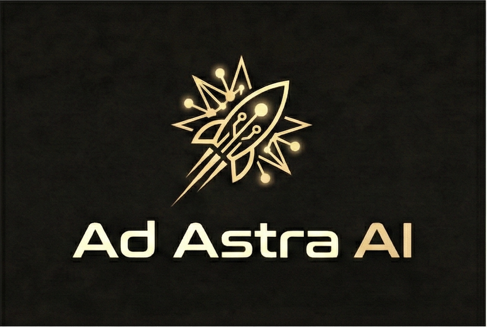
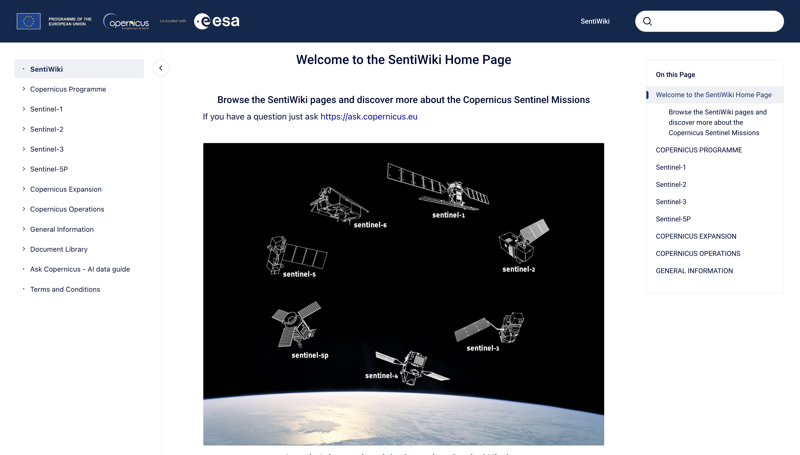
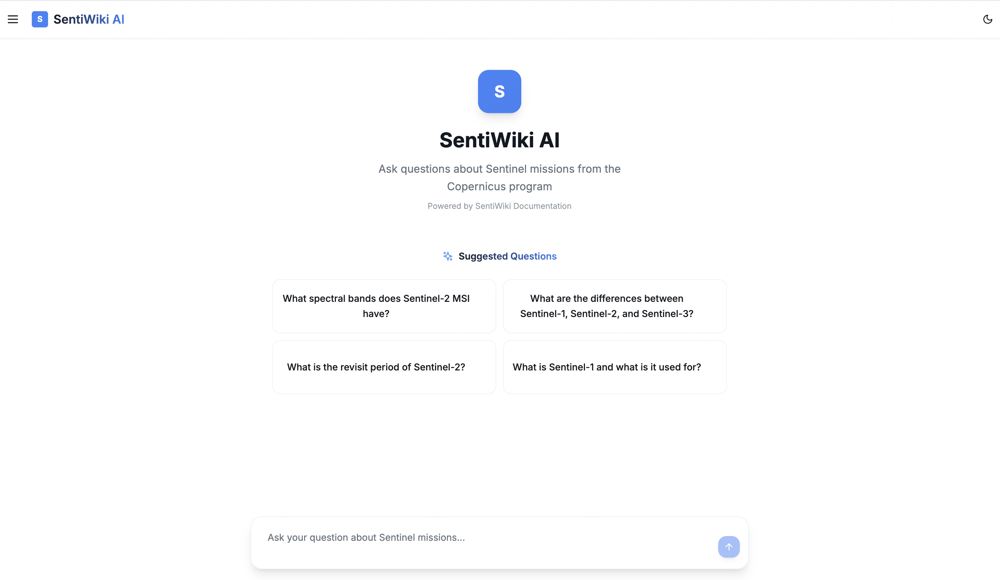
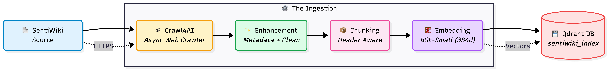
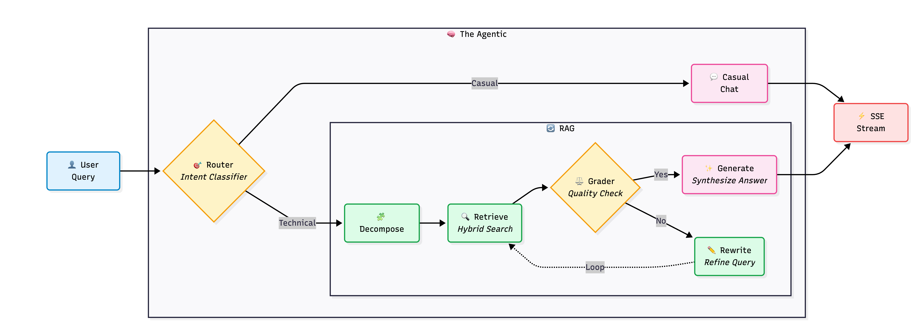
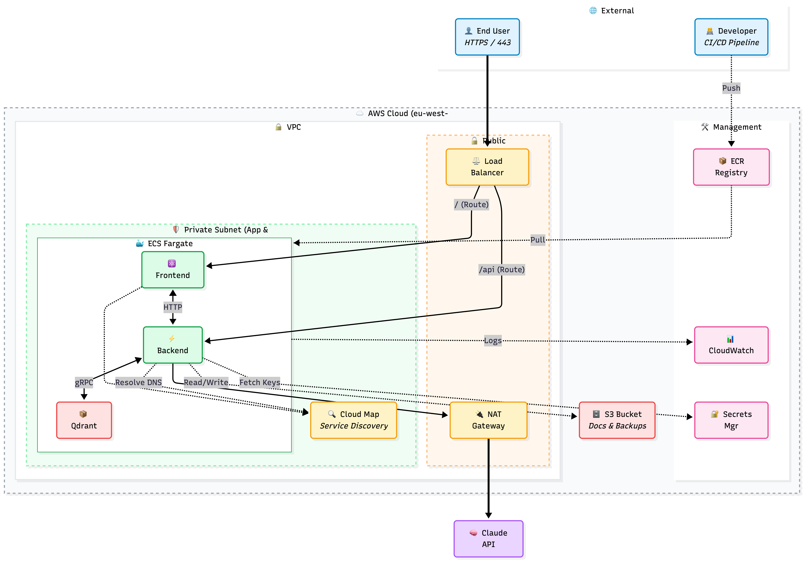

<!-- <p align="center">
  
</p> -->

<h1 align="center">🛰️ SentiWiki AI</h1>
<h3 align="center">End-to-End Agentic RAG for ESA Copernicus Sentinel Missions deployed on AWS ECS</h3>

<p align="center">
  
  
  
  
  
  
</p>

---

## 🎬 Demo Video

**See SentiWiki AI in action!** Watch the system answer complex questions about ESA Copernicus Sentinel missions with real-time streaming responses.

<div style="text-align: center;">
    
</div>

<table style="border-collapse: collapse; border: none;">
  <tr style="border: none;">
    <td width="20%" style="border: none;">
      <a href="https://adastraai.substack.com/" aria-label="Ad Astra AI Newsletter">
        
      </a>
    </td>
    <td width="80%" style="border: none;">
      <div>
        <h2>📬 Stay Updated</h2>
        <p><b><a href="https://adastraai.substack.com/">Join Ad Astra AI</a></b> — A technical hub for production-ready AI engineering projects. Learn best practices for building, deploying, and scaling AI systems in real-world production environments. Weekly deep-dives directly to your inbox. Don't miss out!</p>
      </div>
    </td>
  </tr>
</table>

<p align="center">
  <a href="https://adastraai.substack.com/">
    
  </a>
</p>

<table style="border-collapse: collapse; border: none;">
  <tr style="border: none;">
    <td width="20%" style="border: none;">
      
    </td>
    <td width="80%" style="border: none;">
      <div>
        <h2>🎥 Watch More Content</h2>
        <p><b>Coming soon!</b> Video tutorials and demos exploring how to build production-ready AI systems—from agentic RAG architectures to AWS deployments. Stay tuned!</p>
      </div>
    </td>
  </tr>
</table>

## 📑 Table of Contents

- [About](#about)
- [What you'll get from this project](#what-youll-get-from-this-project)
- [Tech Stack](#tech-stack)
- [Quick Start](#quick-start)
- [Architecture](#architecture)
- [Learning Path (Blog Series)](#learning-path-blog-series)
- [Evaluation Results: RAGAS Metrics on Adversarial Queries](#evaluation-results-ragas-metrics-on-adversarial-queries)
- [How much is this going to cost me?](#how-much-is-this-going-to-cost-me)
- [Legal Disclaimer & Usage Terms](#legal-disclaimer--usage-terms)
- [Acknowledgments](#acknowledgments)
- [About the Author](#about-the-author)

---


## About

**What is SentiWiki?**

[SentiWiki](https://sentiwiki.copernicus.eu/) is ESA's official knowledge base for Copernicus Sentinel Missions, containing comprehensive documentation about mission specifications, instruments, products, applications, and processing workflows. The platform hosts detailed technical information across multiple Sentinel missions (Sentinel-1, Sentinel-2, Sentinel-3, Sentinel-5P, and more), making it an invaluable resource for researchers, engineers, and data users working with Copernicus Earth observation data.

<p align="center">
  
  <br>
  <em>SentiWiki Home Page — ESA's official knowledge base for Copernicus Sentinel Missions</em>
</p>

**The Problem:**

Researchers struggle to find specific technical details buried across multiple documents—questions like "What's the swath width of Sentinel-1's IW mode?" require manually searching through dozens of webpages.

**The Solution:**

**SentiWiki AI** is an **end-to-end agentic RAG system** that transforms SentiWiki's extensive documentation into an intelligent, queryable knowledge base. Instead of manually searching through dozens of webpages, researchers can ask natural language questions like "What's the swath width of Sentinel-1's IW mode?" and get instant, accurate answers with source citations.

<p align="center">
  
  <br>
  <em>SentiWiki AI — Clean, modern chat interface for querying Sentinel missions documentation</em>
</p>

**System Architecture:**

The system is built as a **production-grade, fully deployed stack** on AWS ECS Fargate, demonstrating real-world engineering practices:

- 🕷️ **End-to-End Data Pipeline:** Complete 5-stage pipeline from web scraping to vector indexing: (1) Async web crawling with Crawl4AI + Playwright, (2) Markdown enhancement with HTML cleaning and metadata extraction, (3) Structure-aware chunking preserving document hierarchy, (4) Embedding generation with Sentence Transformers, (5) Vector indexing in Qdrant with rich metadata

- 🧠 **Agentic Intelligence:** LangGraph-based routing intelligently decides between RAG (technical queries) and direct LLM (casual chat), rewrites vague queries, and decomposes multi-hop comparisons

- 🔍 **Hybrid Retrieval:** Combines semantic vector search with BM25 keyword matching to handle technical acronyms like "SLSTR" or "L2A" that pure embeddings miss, plus cross-encoder reranking for relevance and **smart metadata filtering** to ensure mission-specific queries (e.g., Sentinel-1 vs Sentinel-2) return the correct documents

- ⚡ **Production Backend:** Asynchronous FastAPI with SSE streaming, concurrent request handling, rate limiting, and graceful error handling

- ☁️ **Serverless Deployment:** AWS ECS Fargate with auto-scaling (1-5 tasks), Application Load Balancer routing, and full observability stack

- 📊 **Complete Observability:** Prometheus metrics, Grafana dashboards, and LangSmith traces for end-to-end debugging

**Validation:** The system has been evaluated on adversarial queries, achieving **94.91% faithfulness** with zero hallucinations. It's a real, production-tested system, not just a demo.

---

## What you'll get from this project

This project serves **two purposes**: a **ready-to-use system** for querying Sentinel documentation, and a **complete learning resource** for building production RAG systems.

**🚀 Ready-to-Use System:**
- **Query Sentinel missions** with complex, technical questions and get grounded, source-cited answers in seconds
- **Run locally** in 5 minutes: complete stack (Qdrant, API, frontend, monitoring) with Docker Compose
- **Deploy to production** in 15-20 minutes: automated AWS ECS Fargate deployment scripts included

**📚 Learning & Template:**
- **Reuse the architecture** as a production-tested template for your own technical documentation (just swap the corpus)
- **Learn production RAG patterns**: structure-aware chunking, hybrid search, cross-encoder reranking, agentic routing with LangGraph, and systematic evaluation
- **See the complete pipeline**: from web scraping (Crawl4AI) to production deployment (AWS ECS), nothing is hidden
- **Study real metrics**: RAGAS evaluation results, Prometheus/Grafana dashboards, LangSmith traces
- **Learn from real decisions**: 9 deep-dive blog articles documenting what worked, what failed, and why

**Bottom line:** Use it as both a **working system** and a **mini-course in production RAG engineering**.

---

## Tech Stack

<div align="center">

<table>
<tr>
<td align="center" width="96">
  <a href="https://www.langchain.com/langgraph">
    
  </a>
  <br><strong>LangGraph</strong>
</td>
<td align="center" width="96">
  <a href="https://qdrant.tech/">
    
  </a>
  <br><strong>Qdrant</strong>
</td>
<td align="center" width="96">
  <a href="https://fastapi.tiangolo.com/">
    
  </a>
  <br><strong>FastAPI</strong>
</td>
<td align="center" width="96">
  <a href="https://docs.litellm.ai/">
    
  </a>
</td>
<td align="center" width="96">
  <a href="https://nextjs.org/">
    
  </a>
  <br><strong>Next.js</strong>
</td>
<td align="center" width="96">
  <a href="https://docs.ragas.io/">
    
  </a>
  <br><strong>RAGAS</strong>
</td>
</tr>
<tr>
<td align="center" width="96">
  <a href="https://aws.amazon.com/ecs/">
    
  </a>
  <br><strong>AWS ECS</strong>
</td>
<td align="center" width="96">
  <a href="https://prometheus.io/">
    
  </a>
  <br><strong>Prometheus</strong>
</td>
<td align="center" width="96">
  <a href="https://grafana.com/">
    
  </a>
  <br><strong>Grafana</strong>
</td>
<td align="center" width="96">
  <a href="https://www.anthropic.com/">
    
  </a>
  <br><strong>Claude 3</strong>
</td>
<td align="center" width="96">
  <strong><a href="https://crawl4ai.com/">Crawl4AI</a></strong>
</td>
<td align="center" width="96">
  <a href="https://www.docker.com/">
    
  </a>
  <br><strong>Docker</strong>
</td>
</tr>
</table>

</div>

---

## Quick Start

**Get running in 5 minutes locally, or deploy to AWS in 15-20 minutes.**

**Not sure where to start?** Choose your path:

- 💻 **Just want to try it?** → [Local Development](#local-development) (5-10 minutes)
- ☁️ **Want production deployment?** → [AWS Deployment](#aws-deployment) (15-20 minutes)
- 📖 **Want to understand the architecture first?** → [Architecture](#architecture) + [Blog Series](#-learning-path-blog-series)

> **First time with RAG systems?** Start local. You can always deploy to AWS later when you're ready.

#### Prerequisites

```bash
# Required
Python 3.11+
Docker & Docker Compose
LLM API key (configured via LiteLLM — supports 7 providers: Anthropic, OpenAI, Google, Groq, Cohere, Mistral, and AWS Bedrock. See [LLM Providers Guide](docs/public/LLM_PROVIDERS_GUIDE.md))
```

#### Environment Configuration (LLM API Keys)

Before running the pipeline or API, create a `.env` file in the project root (same folder as `pyproject.toml`) and add your LLM API key:

```bash
# Required for default setup (Claude via Anthropic)
ANTHROPIC_API_KEY=your_anthropic_key_here
```

Alternatively, you can export these variables directly in your shell instead of using a `.env` file.

**📚 Using a different LLM provider?** SentiWiki AI supports **7 providers** through LiteLLM: Anthropic (default), OpenAI, Google, Groq, Cohere, Mistral, and AWS Bedrock. See the [LLM Providers Guide](docs/public/LLM_PROVIDERS_GUIDE.md) for complete configuration instructions.

**⚠️ Important: When changing LLM API keys**, you must update **both**:
1. **GitHub Secrets** (if using CI/CD): Add or update the API key secret (e.g., `ANTHROPIC_API_KEY`, `OPENAI_API_KEY`)
2. **`config/settings.yaml`**: Update the LLM provider and model configuration in the `llm` section to match your new provider

For example, if switching from Anthropic to OpenAI:
- Add `OPENAI_API_KEY` to GitHub Secrets
- Update `config/settings.yaml`:
  ```yaml
  llm:
    provider: "openai"  # Changed from "anthropic"
    model: "gpt-4"      # Changed from "claude-3-haiku-20240307"
  ```

See [`config/settings.yaml`](config/settings.yaml) for all available LLM configuration options.

#### Local Development

```bash
# 0. (If needed) Clone and enter repo
git clone https://github.com/YOUR_USERNAME/sentiwiki_ai.git
cd sentiwiki_ai

# 1. Install backend deps
curl -LsSf https://astral.sh/uv/install.sh | sh
uv venv && source .venv/bin/activate
uv pip install -e ".[dev]"

# 2. Generate data (SentiWiki pipeline)
uv run python -m src.crawlers.scrape_sentiwiki_crawl4ai
uv run python scripts/data/enhance_sentiwiki.py
uv run python -m src.parsers.sentiwiki_chunker
uv run python -m src.db.populate_vectors

# 3. Start infra
docker compose -f deployment/docker/docker-compose.yml up -d qdrant prometheus grafana

# 4. Start API + frontend
uv run uvicorn src.api.main:app --host 0.0.0.0 --port 8002 --reload
cd frontend && npm install && npm run dev
```

**💡 Tip**: This project includes a **Makefile** with convenient shortcuts for common commands. Instead of typing the full commands above, you can use:
- `make init` - Install dependencies
- `make dev-api` - Start API server
- `make dev-frontend` - Start frontend
- `make test` - Run tests
- `make eval-ragas` - Run RAGAS evaluation
- `make help` - See all available commands

For a more narrative, step-by-step introduction and full CLI reference, see [`docs/public/SCRIPTS_OVERVIEW.md`](docs/public/SCRIPTS_OVERVIEW.md) and [`data/README.md`](data/README.md).

#### Access Points

| Service | URL | Description |
|---------|-----|-------------|
| **Frontend** | http://localhost:3000 | Next.js chat interface (primary way to talk to the system) |
| **API** | http://localhost:8002 | FastAPI backend (for direct HTTP testing) |
| **API Docs** | http://localhost:8002/docs | Swagger UI (you can send test chat requests here) |
| **Qdrant** | http://localhost:6333/dashboard | Vector DB UI |
| **Grafana** | http://localhost:3002 | Metrics dashboard |
| **Prometheus** | http://localhost:9090 | Metrics collector |

---

### CI/CD Configuration (GitHub Secrets)

You can also easily integrate CI/CD with GitHub Actions for this project. 

📖 **CI/CD Guide**: See [`docs/public/CI_CD_GUIDE.md`](docs/public/CI_CD_GUIDE.md) for complete instructions on how the GitHub Actions workflow works, including how to customize it and troubleshoot common issues.

**For CI/CD deployments**, this project uses **GitHub Secrets** to securely store credentials for automated builds and deployments.

**Required GitHub Secrets:**
- `AWS_ACCESS_KEY_ID` - AWS access key for ECR push and ECS deployment
- `AWS_SECRET_ACCESS_KEY` - AWS secret key for ECR push and ECS deployment
- `AWS_REGION` - AWS region (e.g., `us-east-1`, `eu-west-1`)
- `AWS_ACCOUNT_ID` - Your AWS account ID

**To configure GitHub Secrets:**
1. Go to your GitHub repository → **Settings** → **Secrets and variables** → **Actions**
2. Click **New repository secret**
3. Add each secret with its corresponding value

**⚠️ Important: When changing LLM API keys**, you must update **both**:
1. **GitHub Secrets** (if using CI/CD): Add or update the API key secret (e.g., `ANTHROPIC_API_KEY`, `OPENAI_API_KEY`)
2. **`config/settings.yaml`**: Update the LLM provider and model configuration in the `llm` section to match your new provider.

---

### AWS Deployment

Deploy the full stack to AWS ECS Fargate with automated scripts.

📖 **Detailed Guide**: See [`docs/public/AWS_DEPLOYMENT_GUIDE.md`](docs/public/AWS_DEPLOYMENT_GUIDE.md) for complete AWS deployment instructions.

⚠️ **IAM Requirements**: Before running deployment scripts, ensure you have the required IAM permissions. See [`docs/public/AWS_IAM_REQUIREMENTS.md`](docs/public/AWS_IAM_REQUIREMENTS.md) for complete IAM policy setup.

#### Prerequisites

```bash
# Required
- AWS Account
- AWS CLI configured (`aws configure`)
- IAM permissions configured (see AWS_IAM_REQUIREMENTS.md)
```

**Before you start**: Ensure your IAM user/role has the required permissions. See [`docs/public/AWS_IAM_REQUIREMENTS.md`](docs/public/AWS_IAM_REQUIREMENTS.md) for complete IAM policy setup instructions.

#### Deployment Steps

```bash
# 1. Setup infrastructure (VPC, ALB, ECS cluster, S3 buckets)
cd deployment/aws/scripts
./setup-infrastructure.sh

# 2. Create Secrets in AWS Secrets Manager
# Option A: From AWS Console
#   - Go to Secrets Manager → Create secret
#   - Name: esa-iagen/ANTHROPIC_API_KEY
#   - Value: your-api-key-here
# Option B: From CLI
source ../infrastructure-ids.txt
aws secretsmanager create-secret \
  --name esa-iagen/ANTHROPIC_API_KEY \
  --secret-string "your-api-key-here" \
  --region $AWS_REGION

# 3. Configure IAM Permissions
# See docs/public/AWS_IAM_REQUIREMENTS.md for complete IAM policy setup
# Key requirements:
#   - Deployment user/role: Full ECS/ECR/VPC/ALB permissions
#   - ECS task execution role: Secrets Manager, S3, CloudWatch access

# 4. Register task definitions
./register-task-definitions.sh

# 5. Create ECS services
./create-services.sh

# 6. Sync CORS configuration
./sync-api-cors.sh

# 7. Get ALB DNS name
./get-service-ips.sh
```

#### What Gets Created

- ✅ **ECS Cluster** with Fargate tasks (API, Frontend, Qdrant, Prometheus, Grafana)
- ✅ **Application Load Balancer** with path-based routing
- ✅ **S3 Buckets** for query logs and backups
- ✅ **Service Discovery** for internal DNS
- ✅ **Auto-scaling** policies (1-5 tasks based on CPU/memory)
- ✅ **CloudWatch** logging and metrics

**Total setup time**: ~15-20 minutes

---

### Create Collections After Deployment

⚠️ **Important**: After deploying to AWS, you must create collections in Qdrant before the system can answer queries. The deployed system starts with an empty vector database.

#### Upload Locally-Generated Data

This maintains legal compliance by requiring you to generate data locally:

```bash
# 1. Generate data locally (on your machine)
cd /path/to/sentiwiki_ai
uv run python -m src.crawlers.scrape_sentiwiki_crawl4ai
uv run python scripts/data/enhance_sentiwiki.py
uv run python -m src.parsers.sentiwiki_chunker

# 2. Create zip archive
cd data/processed
zip -r sentiwiki_structured.zip sentiwiki_structured/

# 3. Upload to your deployed API
curl -X POST "http://<ALB_DNS>/api/v1/upload-and-index" \
  -F "file=@sentiwiki_structured.zip" \
  -F "collection=sentiwiki_index" \
  -F "recreate=true"

# 4. Track indexing progress (use job_id from response)
curl "http://<ALB_DNS>/api/v1/index/status/{job_id}"
```

#### Use Swagger UI

1. Open `http://<ALB_DNS>/docs` in your browser
2. Find the `/api/v1/upload-and-index` endpoint
3. Click "Try it out"
4. Upload your zip file and specify collection name
5. Monitor progress via `/api/v1/index/status/{job_id}`

**Note**: Replace `<ALB_DNS>` with your actual ALB DNS name (from `./get-service-ips.sh`).

📖 **Detailed instructions**: See [`data/README.md`](data/README.md) for complete upload and indexing guide.

---

### Using Your Production System

Once deployed, access all services via a single ALB URL:

```bash
# Get your ALB DNS
cd deployment/aws/scripts && ./get-service-ips.sh
```

**Available Endpoints**:

| Endpoint | URL | Description |
|----------|-----|-------------|
| **Frontend** | `http://<ALB_DNS>/` | Next.js chat interface |
| **Swagger UI** | `http://<ALB_DNS>/docs` | Interactive API documentation |
| **Health Check** | `http://<ALB_DNS>/health` | API health status |
| **Chat API** | `http://<ALB_DNS>/api/v1/chat?query=...` | Agent-based RAG endpoint |
| **Retrieval API** | `http://<ALB_DNS>/api/v1/retrieve?query=...` | Document search endpoint |

---

## Architecture

The system follows a **Layered Architecture** separating the presentation layer (Next.js) from the cognitive core (FastAPI + LangGraph), ensuring clean separation of concerns and scalable deployment.

### Data Pipeline

The foundation of SentiWiki AI is a robust 5-stage data pipeline that transforms raw web content into a searchable vector knowledge base:

<p align="center">
  
</p>

**Pipeline Stages:**
1. **Scraping** (Crawl4AI): Async web crawling with Playwright rendering, extracts markdown, PDFs, and page metadata
2. **Enhancement**: Cleans HTML artifacts, normalizes formatting, extracts frontmatter metadata (mission, section, URLs)
3. **Chunking**: Structure-aware splitting using MarkdownHeaderTextSplitter (512 tokens/chunk, preserves heading hierarchy)
4. **Embedding**: Sentence-Transformers (BAAI/bge-small-en-v1.5) generates 384-dim vectors with L2 normalization
5. **Indexing**: Qdrant HNSW index for fast cosine similarity search (~10K chunks indexed)

### Agentic Intelligence Layer

The system uses LangGraph-based agents to intelligently route queries and decompose complex questions:

<p align="center">
  
</p>

**Key Capabilities:**
- **Intelligent Routing**: Automatically decides between RAG (technical queries) and direct LLM (casual chat)
- **Query Decomposition**: Breaks down multi-hop questions into sub-queries for better retrieval
- **Context Assembly**: Combines information from multiple documents to answer complex questions
- **Source Attribution**: Provides citations for all retrieved information

### AWS Production Deployment

Deployed on **AWS ECS Fargate** for serverless scalability. Security is managed via **Private Subnets** and **VPC Isolation**, ensuring no direct access to the inference containers.

<p align="center">
  
</p>

**Infrastructure Components:**
- **Compute:** ECS Fargate (Spot Instances for cost optimization)
- **Storage:** S3 (Logs & Backups) + Qdrant (Vector Store)
- **Networking:** ALB (Path-based routing) + NAT Gateway for egress
- **Security:** VPC with Private Subnets, Secrets Manager for API keys
- **Observability:** CloudWatch Logs + Prometheus/Grafana dashboards

**AWS Services Used:**
- **ECS Fargate** — Serverless container orchestration
- **ALB** — Path-based routing (`/` → Frontend, `/api/*` → API)
- **ECR** — Private Docker registry
- **CloudWatch** — Centralized logging & monitoring
- **Secrets Manager** — Secure API key storage
- **S3** — Query history & backups
- **Service Discovery** — Internal DNS (`.esa-iagen.local`)
- **IAM** — Fine-grained permissions

---

## Learning Path (Blog Series)

I documented the development in a **9-article technical blog**, structured as a **step-by-step learning path** from first ideas to production deployment:

📖 **Read the full series on Substack:** [SentiWiki AI Series](https://adastraai.substack.com/t/sentiwiki-ai)

| Article | Topics | Link |
|---------|--------|------|
| 01 - Project Overview | Vision, architecture decisions, high-level goals, and why I built this system | [Read on Substack](https://adastraai.substack.com/p/sentiwiki-ai-part-1-end-to-end-agentic?r=769s4j) |
| 02 - Data Scraping | Crawl4AI setup, async web scraping with Playwright, handling 66+ SentiWiki documents, and extracting structured markdown | [Read on Substack](https://adastraai.substack.com/p/sentiwiki-ai-part-2-data-scraping?r=769s4j) |
| 03 - Chunking & Ingestion | Structure-aware chunking with MarkdownHeaderTextSplitter, embedding model selection (BAAI/bge-small-en-v1.5), Qdrant vector DB setup, and indexing strategies | [Read on Substack](https://open.substack.com/pub/adastraai/p/sentiwiki-ai-part-3-chunking-and?r=769s4j&utm_campaign=post&utm_medium=web&showWelcomeOnShare=true) |
| 04 - Advanced Retrieval Pipeline | Building a three-stage retrieval pipeline: hybrid search (semantic + BM25), cross-encoder reranking, and metadata filtering (enabled by default) for mission-specific query accuracy | _To be released_ |
| 05 - Agentic RAG with LangGraph | LangGraph-based agentic routing, query decomposition (43% improvement), intelligent decision-making between RAG and direct LLM paths, and building production-ready agent workflows | _To be released_ |
| 06 - Evaluation & Monitoring | RAGAS evaluation framework, building adversarial test sets, achieving 94.91% faithfulness, Prometheus metrics, Grafana dashboards, LangSmith tracing, and production monitoring | _To be released_ |
| 07 - Backend with FastAPI & Frontend with Next.JS | FastAPI async API with streaming SSE responses, Docker containerization, Next.js 14 real-time chat UI, and full-stack integration patterns | _To be released_ |
| 08 - Docker Compose & CI/CD with GitHub Actions | Docker Compose setup for local development, GitHub Actions workflow configuration, automated testing, Docker image building, and ECR push automation | _To be released_ |
| 09 - AWS Deployment | ECS Fargate architecture, Application Load Balancer routing, Secrets Manager for API keys, S3 for data storage, service discovery, auto-scaling, and cost optimization | _To be released_ |

---

## Evaluation Results: RAGAS Metrics on Adversarial Queries

**The Challenge:** Testing RAG systems with easy questions tells you nothing. Anyone can answer "What is Sentinel-1?" — it's the first line of every document.

**Configuration:** Results were obtained with **metadata filtering enabled** to ensure mission-specific queries (e.g., "What's the width of Sentinel-1?") correctly filter to the right mission documents and avoid cross-contamination between missions.

**Evaluation Setup:** The evaluation uses **local embeddings** (same model as your Qdrant collection) for **Context Precision** and **Context Recall** metrics — no API key needed for these! However, an **LLM API key is required** for **Faithfulness** and **Answer Relevancy** metrics, which use LLM-based evaluation. The script automatically reuses your `ANTHROPIC_API_KEY` (or other provider key) from environment variables. The LLM model for evaluation can be configured in `config/settings.yaml` under `llm.eval_llm`. If no API key is provided, the evaluation will still run but only compute the embedding-based metrics.

**Results on adversarial queries:**

| Metric | Score | What This Actually Means |
|--------|:-----:|--------------------------|
| **Faithfulness** | **94.91%** | Answers cite actual docs, not hallucinated. Zero hallucinations (no queries with Faithfulness < 0.5). |
| **Context Recall** | **76.39%** | System retrieves the right documents 76% of the time, even for hard queries. |
| **Context Precision** | **72.00%** | Top-ranked documents are relevant (reranking works). |
| **Answer Relevancy** | **70.89%** | Responses directly address what was asked. Lower score reflects system's conservative approach: it correctly refuses to answer trick questions (which RAGAS penalizes, but humans value). |


📄 **Run it yourself**: see [`docs/public/ADVERSARIAL_TESTSET.md`](docs/public/ADVERSARIAL_TESTSET.md) for the full adversarial test set and how to run evaluation locally.

---


## How much is this going to cost me?


For running the project locally, the  only cost would be that one of the LLM API key (Anthropic in our case). Qdrant (self-hosted), and Docker are more than enough to get you going.

For AWS ECS Fargate, the cost really depends on **how many hours you keep the stack running** and which LLM provider you use. A small, single-region setup like this is typically on the order of **cents per hour** for infrastructure, plus LLM usage.

**Cost Breakdown (ballpark):**
- **Local Development**: LLM API key
- **AWS Infrastructure (Fargate + monitoring)**: roughly a few **cents per hour** for a small stack when it's running
- **Per Query (LLM usage)**: on the order of **$0.01–$0.03** per complex query (includes LLM, infrastructure, processing)


## Legal Disclaimer & Usage Terms

**IMPORTANT: This project is for non-commercial, educational use only.**

### Copyright & Data Usage

- **SentiWiki Content**: This repository does **NOT** include any scraped or processed content from [SentiWiki](https://sentiwiki.copernicus.eu/) (ESA's Copernicus Sentinel documentation website).
- **Why?**: SentiWiki content is copyrighted by the European Space Agency (ESA). According to [ESA's Terms and Conditions](https://sentiwiki.copernicus.eu/web/terms-and-conditions), users may download and copy information for **non-commercial use**, but **redistribution** or **creating derivative works** requires prior written authorization from ESA.
- **What's Included**: This repository contains only the **code and pipeline** to scrape, process, and index SentiWiki content. Users must generate the data locally by running the provided scripts.

### Data Generation

To use this system, you must generate the data locally:

```bash
# See data/README.md for full instructions
uv run python -m src.crawlers.scrape_sentiwiki_crawl4ai
uv run python scripts/data/enhance_sentiwiki.py
uv run python -m src.parsers.sentiwiki_chunker
uv run python -m src.db.populate_vectors
```

**Note**: For private Docker images deployed to your own AWS infrastructure, you may include the processed data in your private image build, as this does not constitute public redistribution.

---

## Acknowledgments

- **European Space Agency (ESA)** — for the [Copernicus Programme](https://www.copernicus.eu/) and broader [ESA](https://www.esa.int/) ecosystem that makes this work possible.
- **SentiWiki Documentation Team** — for maintaining [SentiWiki](https://sentiwiki.copernicus.eu/), the core documentation corpus used by this project.
- **Open Source Community** — LangGraph, Qdrant, FastAPI, LiteLLM, Crawl4AI, and many others who make projects like this possible.

<p align="center">
  <strong>⭐ If this project helped you, consider giving it a star on GitHub! ⭐</strong>
  <br><br>
</p>

---

## About the Author

<table style="border-collapse: collapse; border: none;">
  <tr style="border: none;">
    <td width="20%" style="border: none;">
      <div style="text-align: center;">
        
        <br><br>
        <a href="https://adastraai.substack.com/">
          
        </a>
      </div>
    </td>
    <td width="80%" style="border: none;">
      <div>
        <h2>Andrés Ruiz Calvo</h2>
        <p><strong>AI Engineer</strong> building production-ready AI systems.</p>
        <p>This project is part of <strong><a href="https://adastraai.substack.com/">Ad Astra AI</a></strong>, a technical hub where I build production-ready AI engineering projects. Drawing from my experience as an AI engineer, I teach best practices for building, deploying, and scaling AI systems in real-world production environments.</p>
      </div>
    </td>
  </tr>
</table>

**What I do:**
- 🏗️ **Build production AI systems** for real-world applications (like this RAG system!)
- 📚 **Write technical articles** documenting real decisions, failures, and solutions
- 🎥 **Create educational content** — Coming soon!
- 🚀 **Share learnings** from deploying and scaling AI systems in production

**Connect with me:**
- 🌐 **Website:** [andrescv.com](https://andresrcv.com/)
- 📧 **Email:** [adastra.ai26@gmail.com](mailto:adastra.ai26@gmail.com)
- 💼 **LinkedIn:** [linkedin.com/in/andresruizcalvo](https://www.linkedin.com/in/andresruizcalvo/)
- 📬 **Substack:** [Ad Astra AI on Substack](https://adastraai.substack.com/) — Weekly deep-dives on production AI engineering
- 🎥 **YouTube:** Coming soon! — Code, demos, and insights
